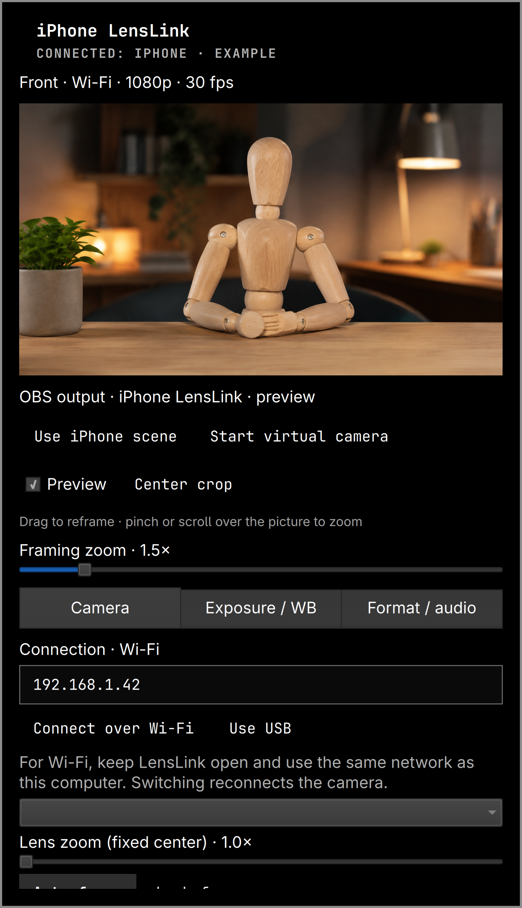

# iPhone LensLink for Omarchy

Omarchy bar controls for an iPhone LensLink → OBS setup over USB or Wi-Fi.
The separate Anker integration is preserved. No camera settings are applied
when opening the panel or reconnecting.



[Preview provenance](docs/ASSETS.md) · [Security verification](docs/SECURITY_VERIFICATION.md)

## Installation

Requires **Omarchy Quattro**, Python 3, coreutils, the host Qt Multimedia
components, OBS Studio 32+ with its WebSocket server enabled, and LensLink
on the computer and iPhone. Compatible with LensLink 1.10.0–1.12.0; live-tested
with 1.10.0 and checked against the 1.12.0 control API. Install these separately;
the plugin does not install packages or create services.

Create an OBS scene named `iPhone LensLink` and one LensLink Camera input named
`iPhone LensLink USB`. Keep that name for either USB or Wi-Fi. Enable the
LensLink local control API on port 9980. OBS WebSocket settings must be in a
private, user-owned configuration file; the plugin reads its password without
printing it. No Anker plugin is required.

```sh
omarchy plugin add https://github.com/camerontucker/omarchy-lenslink.git --enable
omarchy plugin update io.github.camerontucker.lenslink
```

To disable or remove:

```sh
omarchy plugin disable io.github.camerontucker.lenslink
omarchy plugin remove io.github.camerontucker.lenslink
```

For development, `./install` copies files into the user plugin directory and
backs up the previous plugin and shell configuration under
`~/.cache/omarchy-lenslink/`. If QML retains an older component after an update,
run `omarchy restart shell`; this does not restart OBS.

## Wi-Fi or USB

In the **Camera** tab, enter the phone IP address shown in LensLink and click
**Connect over Wi-Fi**. Keep LensLink open on the phone and connect both devices
to the same network. Allow LensLink's Local Network permission on the iPhone.
Click **Use USB** to return to the cable; the saved Wi-Fi address is retained.
Switching reconnects the existing source and can briefly interrupt its video.
The connection label shows the configured transport; the status above it
reports whether the phone has actually connected.

Both modes use the same camera controls, preview and draggable OBS crop.
The existing source keeps its name `iPhone LensLink USB` for compatibility,
including when it is connected over Wi-Fi. No second source is needed.
Only the source's connection mode and, for Wi-Fi, host address are changed;
crop, USB device selection, format and audio settings are retained. Connection
settings are read back from OBS. Enter a numeric IPv4 or IPv6 address; discovery
and hostnames remain available in OBS's own LensLink source properties.

## Framing and preview

**Framing zoom** creates an OBS crop. Zoom above 1×, then drag the picture to
pan it. Hover over the picture and pinch or use two-finger scroll to zoom
(1×–5×). Panning updates while dragging, preserves the crop size and clamps at
the image edges. **Center crop** recenters without changing magnification. The
orientation selector supports landscape, portrait and both flipped positions
while retaining the current crop. LensLink intentionally transmits a fixed
landscape sensor frame, so the plugin cannot detect physical phone rotation.
At 1× the complete image is visible and cannot be panned.

**Lens zoom (fixed center)** changes the phone's camera zoom. The phone has
already discarded surrounding pixels before sending this image to OBS, so
it cannot provide movable framing by itself. **Make current lens zoom
draggable** transfers the combined magnification to OBS (up to 10×) and
resets phone lens zoom to 1× after checking its readback. Framing zoom's
normal slider runs from 1× to 5×. Conversion can differ slightly in appearance
from the camera's own scaling; no lens, focus, format or effects are changed.

Preview uses OBS Virtual Camera when Qt exposes that device. Otherwise it
requests a 640-pixel OBS program screenshot at 10 fps when idle and up to
30 fps during gestures,
including before broadcasting. Images stay in memory and remain visible
until the next image is ready; transient failures show a retry message.
This preview rate does not change the phone or OBS output frame rate.
The preview shows the current OBS program scene. Dragging only affects the
exact iPhone source. Closing the panel or unchecking Preview releases it and
clears the in-memory image; it does not stop broadcasting.

## Direct LensLink controls

The controls are inside the plugin, gated by the phone's advertised state:

- **Camera:** lens selection, lens zoom, auto/locked/manual focus, flashlight
  when present, LensLink green screen and supported depth cutoff.
- **Exposure / WB:** exposure compensation, auto/manual exposure, ISO,
  shutter time, automatic or locked white balance and temperature.
- **Format / audio:** advertised resolution, frame rate and codec, phone
  microphone when enabled, automatic camera start, lip-sync recalibration
  when enabled.

Portrait and Studio Light still belong to the iPhone's Control Center while
LensLink is streaming. They have no supported remote toggle. Effects are
already included in video received by OBS. Changing lens or format can make
Apple effects unavailable; the plugin only changes them on explicit actions.

**Use iPhone scene** selects the existing `iPhone LensLink` program scene.
**Start virtual camera** requires a connected phone in the program scene.
Select **OBS Virtual Camera** in the meeting app. The virtual camera is shared
with Anker and other apps: stopping it stops that shared output. Phone
start/stop uses LensLink's stream commands; starting requires standby and
cannot launch a closed app on the phone. **Start OBS** starts an existing user service named `obs-lenslink.service`
when the WebSocket server is unavailable. This service is optional and is not
created by the plugin; if you do not have it, launch OBS normally.

## Requirements and targeting

Uses LensLink **1.10.0–1.12.0**, HTTP API `127.0.0.1:9980`, OBS WebSocket,
Python standard library, coreutils timeout and Omarchy/Quickshell's existing
Qt components. No production dependencies added.

Exact input: `iPhone LensLink USB`, kind `ios_camera_source`.
Exact scene: `iPhone LensLink`. These names are the required setup contract.
No source creation, scene-collection file editing, OBS filter changes or
Anker writes occur. OBS credentials are read privately and never printed.
Network requests, child processes and JSON payloads are bounded. Preview and
framing share one panel-scoped OBS connection, with one request in flight and
coalesced gesture updates. A fixed 33 ms clock keeps preview responses
arriving during continuous dragging; input never restarts that clock. It closes when the panel closes; each request has
a deadline and failed connections reconnect. Other controls use short-lived
helpers. Tabs have additional horizontal and vertical padding.

HTTP commands discover the source ID and use `?src=<id>`. LensLink 1.10–1.12
falls back to its first source for an unknown ID; the helper refuses a
multi-source registry to avoid ordinary misrouting. Don't replace sources
while commands are in flight: upstream has no atomic identity check. HTTP
204 acknowledges queueing; subsequent polling displays phone readback.

## Verification and IPC

```sh
python3 -B -m unittest discover -s tests -v
QT_QPA_PLATFORM=offscreen /usr/lib/qt6/bin/qmltestrunner -input tests
python3 -I -B lenslink_backend.py state
omarchy plugin validate .
omarchy-shell lenslink.camera diagnostics
```

IPC: `open`, `close`, `refresh`, and `page camera|exposure|format` under
`lenslink.camera`. Disable with
`omarchy plugin disable io.github.camerontucker.lenslink`.
See VERIFICATION.md for live tests and limits.

## API evidence and reuse

- [LensLink v1.12.0 web-control.c](https://github.com/MyNamesEMurray/LensLink/blob/v1.12.0/obs-plugin/src/web-control.c): API routes, source selection and control payloads.
- [LensLink v1.12.0 CameraManager.swift](https://github.com/MyNamesEMurray/LensLink/blob/v1.12.0/ios-app/Sources/CameraManager.swift): fixed wire orientation, camera capabilities and phone-controlled Apple effects.
- [Apple Studio Light API](https://developer.apple.com/documentation/avfoundation/avcapturedevice/isstudiolightenabled): read-only enabled state.

The OBS transport, secure file utilities, bounded process component and MIT
license derive from [Anker C200 Controls](https://github.com/camerontucker/omarchy-anker-c200). Copies are independent;
OBS targeting now uses the exact LensLink name/kind, with bounded larger JSON
strings for preview images. No installed Anker dependency is required.

## Security and acknowledgements

Omarchy plugins run as unsandboxed user code. This plugin has no telemetry,
downloaded executables, package-manager calls or privileged operations. The
control bridge connects only to loopback; OBS/LensLink connects to the phone
address you explicitly enter for Wi-Fi. Use a trusted local network.

[Omarchy](https://github.com/omacom/omarchy) provides the host platform;
[Quickshell](https://quickshell.org/) provides the system QML runtime;
[OBS Studio](https://obsproject.com/) provides the video pipeline; and
[LensLink](https://github.com/MyNamesEMurray/LensLink) provides phone capture
and remote camera controls. These programs are installed separately.
This repository bundles no third-party binaries or libraries.
